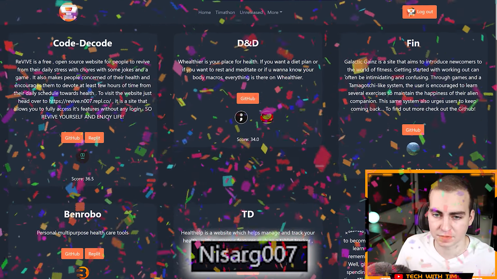
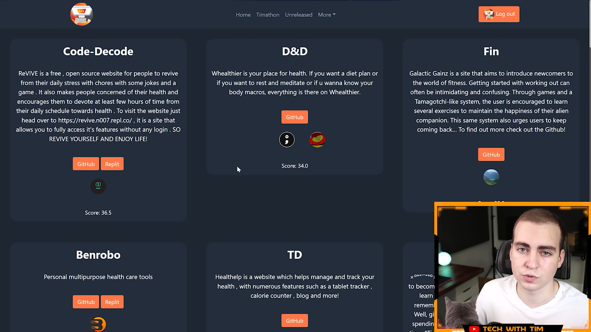

# **ReVIVE – Tech With Tim Code Jam Winner(best project hosted on replit) 🏆**  
*A Health & Wellness Web App built during Tech With Tim Code Jam, scoring the **highest in the judging round** and featured as the **Best Project on Replit**.*  

[](https://www.youtube.com/watch?v=sSW32VaBbNA)  


---

## 📌 **About the Project**  
**ReVIVE** is a fun and engaging **health & wellness web application** built with simplicity and creativity in mind.  
It includes:  
✅ **BMI Calculator** – Know your Body Mass Index instantly.  
✅ **Fun Jokes Section** – Random, family-friendly jokes to keep you smiling.  
✅ **Quiz Game** – Test your knowledge with a quick quiz.  
✅ **Tic Tac Toe Game** – Play against the computer and relax.  

---

## 🏅 **Achievements**
- 🥇 **Highest Score** in the judging round of [Tech With Tim Code Jam](https://www.techwithtim.net/).
- 🏆 **Featured as the Best Project on Replit**.
- 🔥 **Showcased in the Official YouTube Video**:  
[](https://www.youtube.com/watch?v=sSW32VaBbNA)

---

## 📸 **Winner Screenshots**

### 🏆 Best Project On Replit Announcement


### 📊 Highest Score Highlight


---

## 🚀 **Getting Started**
### **Run Locally**
```bash
# Clone the repository
git clone https://github.com/Nisarg0007/ReVIVE_TWT_Codejam.git

# Open the project folder and double-click:
index.html

```
### Creator
Nisarg0007

